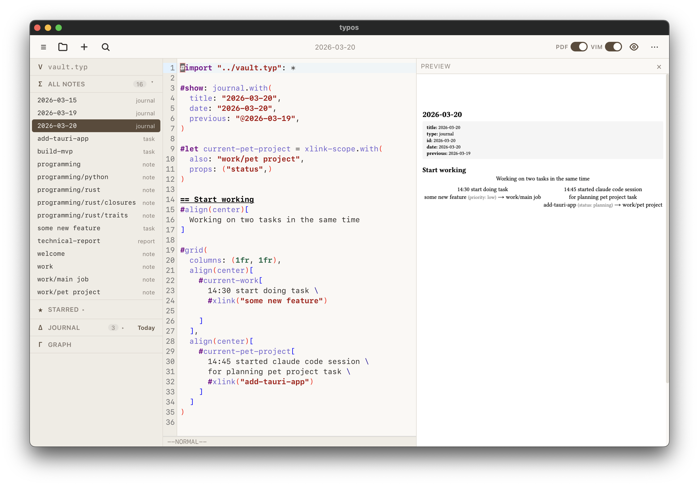
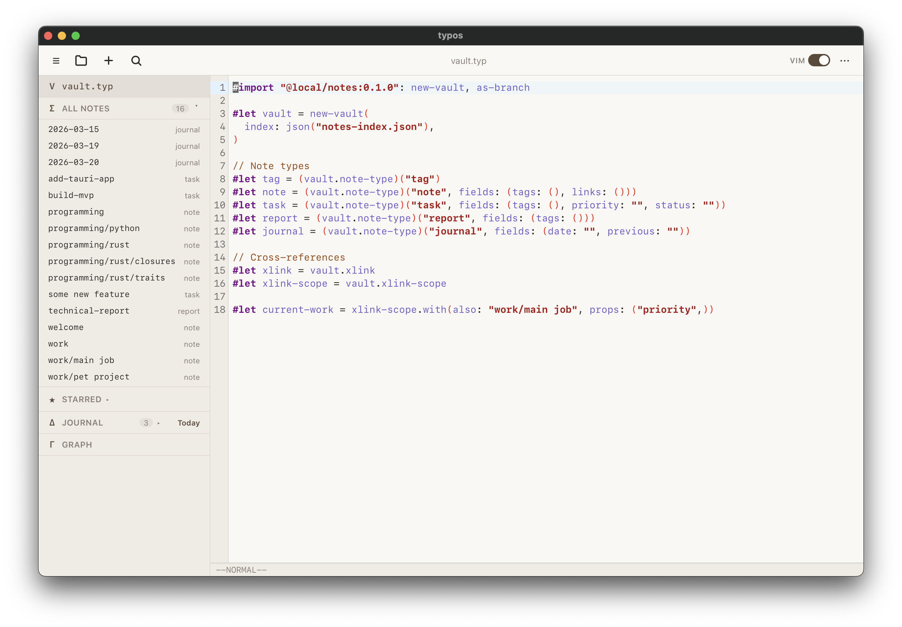

<p align="center">
  
</p>

<h1 align="center">typos</h1>

<p align="center">A note-taking system built on <a href="https://typst.app/">Typst</a> instead of Markdown.</p>

---

### Recent changes (v0.2.4)

- **Dark mode** — warm "parchment at night" theme with syntax-aware editor colors, toggle in toolbar
- **Welcome screen** — onboarding GUI for opening or creating vaults without CLI
- **Cross-platform builds** — macOS (ARM + Intel), Linux (.deb, .AppImage), Windows (.exe)
- **Compilation timeout** — 10s timeout prevents infinite loops from freezing the app
- **Backlinks dedup** — duplicate backlinks from multiple references to the same note are removed

### v0.2.3

- **Tinymist LSP** — integrated Typst language server for autocompletion of built-in functions and parameters
- **Editor improvements** — Tab/Shift-Tab indentation (2 spaces), auto-close brackets, smart Enter indent, toggle comments (Cmd+/)

### v0.2.2

- **PDF preview** — toggle between HTML and pixel-perfect PDF preview (via pdf.js); supports clickable note links
- **xlink-scope** — cross-link two notes from a third (e.g. journal → task → project) with inline property display
- **get-prop** — read any note's property from vault index in Typst
- **Optional properties in PDF export** — choose whether to include metadata when sharing as PDF

---

Notes are plain `.typ` files with built-in support for typed metadata, cross-references, backlinks, and knowledge graphs — all powered by Typst's own type system.

Instead of reinventing frontmatter parsers, Dataview-style query languages, and custom renderers, typos lets Typst do what it already does: functions, types, and content transformations. The tooling layer (Rust) handles AST extraction and indexing, while the Typst framework handles rendering.

<p align="center">
  <br>
  <em>Editor with Typst syntax highlighting and live HTML preview</em>
</p>

<p align="center">
  <br>
  <em>Programmable type system — define your note types in vault.typ</em>
</p>

## Architecture

```
typst-notes/
├── notes-app/          Tauri desktop app (Svelte + CodeMirror)
├── notes-core/         Rust library (AST parsing, indexing, compilation)
├── notes-cli/          CLI binary wrapping notes-core
└── notes-framework/    @local/notes Typst package
```

**Data flow:**
1. You write `.typ` notes with typed constructors and cross-references
2. The indexer parses all files via `typst-syntax` AST and builds `notes-index.json`
3. When Typst compiles a note, the framework reads the index to resolve links and render backlinks

## Desktop App

A native desktop app built with Tauri 2, Svelte 5, and CodeMirror 6. Editor with Typst syntax highlighting, live HTML preview, full-text search, and note management. Typst compiler and framework are bundled — no external dependencies needed for end users.

### Download

| Platform | Download |
|----------|----------|
| macOS (Apple Silicon) | [typos_0.2.4_aarch64.dmg](https://github.com/dailydaniel/typos/releases/latest) |
| macOS (Intel) | [typos_0.2.4_x64.dmg](https://github.com/dailydaniel/typos/releases/latest) |
| Linux (Debian/Ubuntu) | [typos_0.2.4_amd64.deb](https://github.com/dailydaniel/typos/releases/latest) |
| Linux (AppImage) | [typos_0.2.4_amd64.AppImage](https://github.com/dailydaniel/typos/releases/latest) |
| Windows | [typos_0.2.4_x64-setup.exe](https://github.com/dailydaniel/typos/releases/latest) |

> **macOS note:** The app is not yet code-signed. On first launch macOS may show "app is damaged" or "unidentified developer". To fix, run in Terminal:
> ```
> xattr -d com.apple.quarantine /Applications/typos.app
> ```
> Or: System Settings → Privacy & Security → scroll down → click "Open Anyway".

### Prerequisites (building from source)

- [Rust toolchain](https://rustup.rs/)
- [Node.js](https://nodejs.org/) (v18+)
- Typst binary — download from [GitHub releases](https://github.com/typst/typst/releases)
- Tinymist binary (Typst language server) — download from [GitHub releases](https://github.com/Myriad-Dreamin/tinymist/releases)

Place both binaries in `notes-app/src-tauri/binaries/`:

```
notes-app/src-tauri/binaries/
├── typst-aarch64-apple-darwin        # macOS ARM
├── typst-x86_64-apple-darwin         # macOS Intel
├── typst-x86_64-unknown-linux-gnu    # Linux
├── typst-x86_64-pc-windows-msvc.exe  # Windows
├── tinymist-aarch64-apple-darwin     # macOS ARM
├── tinymist-x86_64-apple-darwin      # macOS Intel
├── tinymist-x86_64-unknown-linux-gnu # Linux
└── tinymist-x86_64-pc-windows-msvc.exe # Windows
```

You only need the binaries for your current platform. The notes framework is bundled automatically from `notes-framework/`.

### Development

```bash
cd notes-app
npm install
npx tauri dev
```

### Production build

```bash
cd notes-app
npx tauri build
```

The compiled app bundle will be in `notes-app/src-tauri/target/release/bundle/`.

### Keyboard shortcuts

| Shortcut | Action |
|----------|--------|
| `Cmd+S` | Save current note |
| `Cmd+K` | Search notes |
| `Cmd+O` | Open vault |
| `Cmd+N` | New note |

## CLI

### Installation

```bash
# Requires Rust toolchain
cargo install --path notes-cli

# Install the Typst framework as a local package
# macOS:
cp -r notes-framework/src/ ~/Library/Application\ Support/typst/packages/local/notes/0.1.0/src/
cp notes-framework/typst.toml ~/Library/Application\ Support/typst/packages/local/notes/0.1.0/
# Linux:
cp -r notes-framework/src/ ~/.local/share/typst/packages/local/notes/0.1.0/src/
cp notes-framework/typst.toml ~/.local/share/typst/packages/local/notes/0.1.0/
```

### Create a vault

```bash
notes init my-vault
cd my-vault
```

This generates:
- `vault.typ` — vault configuration with note type definitions
- `note-paths.csv` — registry of all note files
- `notes-index.json` — metadata index
- `notes/welcome.typ` — your first note

### Create notes

```bash
notes new "Build MVP" --type task
notes new "programming/rust" --type note
notes new "programming/rust/closures" --type note
```

The path syntax (`/`) creates a hierarchy. Parent notes are auto-created if they don't exist:

```
notes/build-mvp.typ                   → id: "build-mvp"
notes/programming--rust.typ           → id: "programming/rust"
notes/programming--rust--closures.typ → id: "programming/rust/closures"
```

### Other commands

```bash
notes index                          # rebuild index
notes list                           # list all notes
notes list --type task               # filter by type
notes search "rust"                  # full-text search
notes backlinks "programming/rust"   # show incoming links
notes graph                          # knowledge graph
notes compile programming/rust       # compile to HTML
notes compile programming/rust --format pdf
notes watch welcome                  # live recompilation
notes rename old-id new-id           # rename with reference updates
notes delete note-id                 # delete note
notes sync                           # sync after external changes (e.g. git pull)
```

## Writing Notes

A note is a regular `.typ` file. The title heading is rendered automatically:

```typst
#import "../vault.typ": *

#show: card.with(
  title: "closures",
  tags: ("rust", "fp", "@programming/python"),
  difficulty: "hard",
)

Closures capture variables from their environment.
See also #xlink("programming/rust/traits").
```

**`#show: type.with(title: "...")`** — registers the note with typed metadata. The `id` and `parent` are derived from the filename automatically.

### Cross-references

- **In properties** — `"@id"` string: `tags: ("rust", "@programming/python")`. Rendered as a clickable link, indexed automatically.
- **In body text** — `#xlink("id")`: `See #xlink("programming/rust")`. Rendered as an inline link.

Both appear in backlinks of the target note. Backlinks are rendered automatically at the bottom of each note.

## Framework

The Typst framework (`@local/notes`) provides:

| Module | Purpose |
|--------|---------|
| `vault.typ` | `new-vault()` — initializes vault object from index data |
| `note-type.typ` | Creates typed constructors for `#show:` rules |
| `xlink.typ` | Cross-reference resolution via index lookup |
| `backlinks.typ` | Renders incoming links at the end of each note |
| `graph.typ` | Text-based graph + DOT output for Graphviz |
| `index.typ` | Index reading and query helpers |

The user's `vault.typ` ties it together:

```typst
#import "@local/notes:0.1.0": new-vault, as-branch

#let vault = new-vault(
  index: json("notes-index.json"),
)

#let tag  = (vault.note-type)("tag")
#let note = (vault.note-type)("note", fields: (tags: (), links: ()))
#let task = (vault.note-type)("task", fields: (tags: (), priority: ""))
#let xlink = vault.xlink
```

## Roadmap

- [x] **Tauri app** — desktop GUI with editor, preview, search
- [x] **Compile & watch** — `notes compile` and `notes watch` via typst subprocess
- [x] **Type validation** — CLI validates `--type` against vault.typ definitions
- [x] **Note rename** — `notes rename` with automatic reference updates
- [x] **Typst bundling** — typst binary as Tauri sidecar, framework as bundled resources
- [x] **Autocomplete** — note ID suggestions for `@` references and `#xlink()`
- [x] **Vim mode** — toggleable vim keybindings with `:w`, `:q`, `:wq`
- [x] **Journal** — daily journal entries with automatic date and previous-entry linking
- [x] **Knowledge graph** — interactive graph visualization with vis-network
- [x] **Design system** — warm parchment palette, Greek iconography, custom app icon
- [x] **xlink-scope** — cross-link notes with inline property display
- [x] **PDF preview** — pixel-perfect PDF preview with clickable links (pdf.js)
- [x] **Tinymist LSP** — Typst language server for autocompletion of built-in functions
- [x] **Dark mode** — warm "parchment at night" theme (UI + editor + preview)
- [x] **Cross-platform** — macOS (ARM + Intel), Linux, Windows via GitHub Actions CI
- [ ] **Topos** — rename vault to topos (τόπος) :)
- [ ] **Programmatic compilation** — replace subprocess with `typst` Rust crate (World trait)
- [ ] **Incremental indexing** — skip unchanged files based on mtime
- [ ] **iOS support** — via Tauri v2 mobile

## Acknowledgements

- [Typst](https://github.com/typst/typst) — typesetting engine used for rendering and compilation (Apache-2.0)
- [Tauri](https://github.com/tauri-apps/tauri) — desktop application framework (MIT or Apache-2.0)
- [Tinymist](https://github.com/Myriad-Dreamin/tinymist) — Typst language server for autocompletion (Apache-2.0)
- [CodeMirror](https://github.com/codemirror/dev) — code editor component (MIT)
- [pdf.js](https://github.com/mozilla/pdf.js) — PDF rendering in preview (Apache-2.0)
- [vis-network](https://github.com/visjs/vis-network) — knowledge graph visualization (Apache-2.0)
